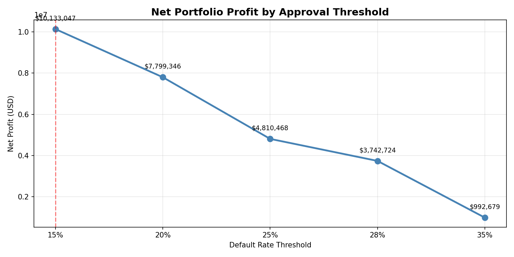
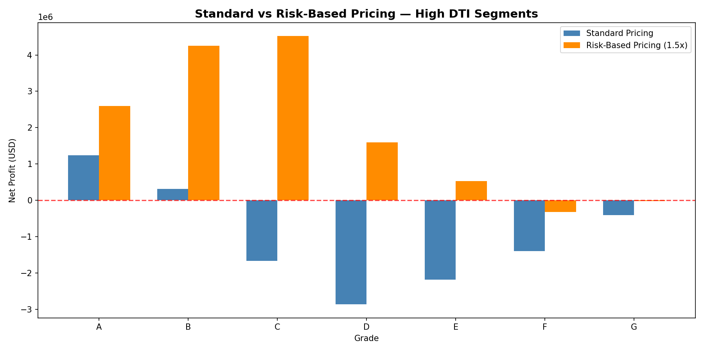

# Loan Risk Analysis — Optimal Approval Strategy

## Business Question
What is the optimal loan approval strategy that maximises portfolio profit while controlling default risk (30+ DPD)?

## Dataset
LendingClub Loan Data (2007–2018) | 2.26M rows | 151 columns
Source: Kaggle (wordsforthewise/lending-club)

## Tools
Python (Pandas) | MySQL Workbench | Power BI

## Project Structure
- Phase 1: Data Cleaning (Python)
- Phase 2: Segment Analysis (MySQL — 3 CTEs)
- Phase 3: Policy Simulation (Python)
- Phase 4: Risk-Based Pricing (Python)

## Key Findings
- Grade A/B segments generate highest net profit at 8-10% default rate
- Approving segments below 15% default threshold maximises profit at $10.1M
- Every threshold increase above 15% costs more in defaults than it earns in interest
- Risk-based pricing (1.5x) converts Grade C/D/E High DTI from loss-making to profitable

## Business Recommendation
Approve Grade A/B at standard rates. Apply 1.5x risk-based pricing for Grade C/D/E High DTI. Reject Grade F/G — no pricing strategy recovers these losses.

## Charts

## Dashboard

[View Power BI Dashboard](https://app.powerbi.com/links/T-C3dnAC0G?ctid=966c22c8-f655-4457-bbc7-102c0e820548&pbi_source=linkShare)
