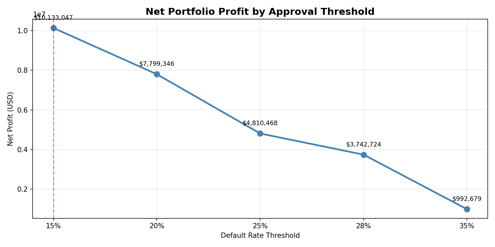
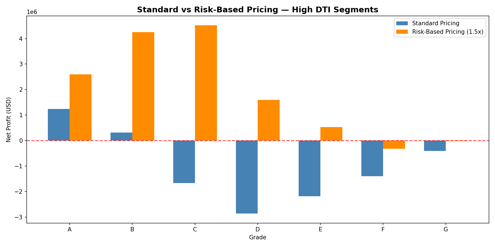

# Loan Risk Analysis — Optimal Approval Strategy

> **Data provenance:** this project uses a public dataset. All figures are outcomes of the analysis, not client results.

---

## Business Question

What is the optimal loan approval strategy that maximises portfolio profit while controlling default risk (31+ DPD and charged-off loans)?

---

## Decision

Approve Grade A/B at standard rates. Apply 1.5x risk-based pricing to Grade C/D/E high-DTI segments, which converts them from loss-making to profitable. Reject Grade F/G — no pricing strategy tested recovers those losses.

Of the thresholds tested, **15% returns the highest net portfolio profit at $10.13M**, approving 65.5% of loans at an 8.4% portfolio default rate. Profit falls monotonically as the threshold is loosened: 20% returns $7.80M, 25% $4.81M, 35% $0.99M.

**Caveat, stated plainly:** 15% is the lowest threshold tested, and profit rises as the threshold tightens across the whole tested range. The curve therefore shows no interior peak — the true optimum may sit below 15%, and thresholds under 15% have not yet been simulated. Calling 15% "the profit-maximising threshold" overstates what this run proves.

---

## Data

| | |
|---|---|
| Source | LendingClub Loan Data, Kaggle (`wordsforthewise/lending-club`) — public |
| Size | 2,260,701 loan records, 151 columns |
| Sample analysed | Random 50,000-row sample (`random_state=42`), reduced to **49,957 rows** after row-level cleaning |
| Period | 2007–2018 |
| Grain | One row per issued loan |

The analysis runs on the 50,000-row random sample, not the full 2.26M. The sample was drawn for tractability before cleaning; it is unweighted and unstratified.

---

## Method

1. **Cleaning (Python, Pandas)** — dropped columns more than 50% null, kept 18 analysis columns from 151, drew a 50,000-row random sample, then dropped rows missing any core field, filled `emp_length` with `Unknown`, `mort_acc` and `pub_rec_bankruptcies` with 0, and `dti` and `revol_util` with the median. Removed zero-income rows, and capped `loan_to_income` at 10. Final: 49,957 rows.
2. **Segment analysis (MySQL)** — a three-CTE master query aggregating default rate, interest earned and principal lost by risk grade and DTI band.
3. **Policy simulation (Python)** — swept approval thresholds across the default-rate range and computed net portfolio profit at each, producing the profit curve.
4. **Risk-based pricing (Python)** — re-ran the loss-making segments at a 1.5x rate multiplier to test whether pricing alone makes them viable.

**Judgement calls:**
- **Default definition:** `loan_status` in {Charged Off, Late (31–120 days), Does not meet the credit policy: Charged Off}. This catches 31+ DPD delinquency before charge-off is recognised. Current, Fully Paid, In Grace Period and Late (16–30 days) are treated as non-default.
- **Segment grain:** profit is computed per grade × DTI bucket using segment averages (avg loan amount × avg interest rate × loan count, less avg loan amount × default count), not loan by loan.
- **DTI buckets:** Low ≤10, Medium 10–20, High 20–35, Very High >35.
- Risk-based pricing applies a 1.5× multiplier to the interest rate of High-DTI segments only.

---

## Key Findings

- Grade A/B segments generate the highest net profit, at an 8–10% default rate
- A 15% default-rate cut-off returns $10.13M net profit, approving 65.5% of loans at an 8.4% portfolio default rate — the best of the five thresholds tested (15 / 20 / 25 / 28 / 35%)
- Loosening the threshold costs more in defaults than it earns in interest at every step tested
- Risk-based pricing at 1.5× converts the three loss-making High-DTI segments to profit: Grade C −$1.67M → +$4.52M, Grade D −$2.87M → +$1.59M, Grade E −$2.19M → +$0.53M
- Grade F and G High-DTI stay negative even at 1.5× (−$0.32M and −$0.02M), so no pricing level tested rescues them

---

## Limitations

- **Threshold range not fully explored.** Only five thresholds were simulated and 15% is the tightest of them. Since profit increases monotonically as the threshold tightens, the optimum is not bracketed. Thresholds of 5% and 10% need simulating before the 15% figure can be called optimal.
- **Sampling.** The analysis runs on an unstratified random 50,000-row sample of 2.26M. Small segments (Grade G, Very High DTI) carry few observations, so their default rates are noisy.
- **Interest is single-period.** Profit treats interest as one year's coupon on the average loan amount, while a default loses the full principal. Real loans run 36 or 60 months, so the model understates interest earned on performing loans and overstates net loss on defaults in the same breath.
- **Survivorship in the data.** LendingClub records only approved loans. Applicants who were rejected have no repayment outcome, so the model learns the behaviour of an already-filtered population and will look better than it would on the full applicant pool. Correcting this needs reject inference, which the public dataset cannot support.
- **Profit is simplified.** Interest earned minus principal lost. No cost of funds, no servicing cost, no recovery on defaulted principal. Including recovery would raise the optimal threshold; including servicing cost would lower it.
- **Default risk is described as 30+ DPD loosely.** The operative definition is 31–120 days late plus charged off; it does not include 16–30 day delinquency.
- **Period effects.** 2007–2018 spans the financial crisis and the subsequent credit expansion. A single pooled model treats a 2009 loan and a 2017 loan as equivalent. Vintage cohorts would separate them.
- **No macro overlay.** Default rates are historical averages, not forward-looking under scenarios.
- **US market.** Grades, DTI conventions and bureau behaviour do not transfer directly to Indian lending.

---

## Tools

Python (Pandas) · MySQL Workbench · Power BI

---

## Dashboard

[View interactive Power BI dashboard (public, no login)](https://app.powerbi.com/view?r=eyJrIjoiMGZiNTg0MWYtNzA0Yi00N2E0LTgzMDAtMGJiNzI1N2VkZjgzIiwidCI6Ijk2NmMyMmM4LWY2NTUtNDQ1Ny1iYmM3LTEwMmMwZTgyMDU0OCJ9&embedImagePlaceholder=true)

---

*Part of Rahul Bhagat's Data Analytics Portfolio | [github.com/rahulbhagat29](https://github.com/rahulbhagat29)*
