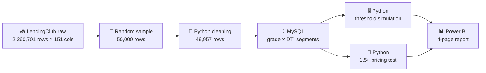

# 💳 Loan Risk Analysis — Who Should a Lender Say Yes To?


-2E7D32)

> **⚡ 30-second version**
> - 🎯 **Question:** at what default-rate cut-off does a loan book make the most money — and can pricing rescue the risky segments?
> - 📉 **Threshold:** tightening the cut-off from 35% to 15% lifts net profit from **$0.99M to $10.13M**.
> - 💸 **Pricing:** a 1.5× rate on High-DTI borrowers flips Grades **C, D and E** from loss to profit. Grades **F and G** stay loss-making at any tested price.
> - ⚠️ **Honest limit:** 15% is the *best threshold tested*, not a proven optimum — see the warning below.

> **Data provenance:** public dataset. All figures are outcomes of the analysis, not client results.

---

## 🗺️ How the pipeline flows


```mermaid
flowchart LR
    A[📥 LendingClub raw<br/>2,260,701 rows × 151 cols] --> B[🎲 Random sample<br/>50,000 rows]
    B --> C[🧹 Python cleaning<br/>49,957 rows]
    C --> D[🗄️ MySQL<br/>grade × DTI segments]
    D --> E[🎚️ Python<br/>threshold simulation]
    D --> F[💸 Python<br/>1.5× pricing test]
    E --> G[📊 Power BI<br/>4-page report]
    F --> G
```

---

## 📦 Data at a glance

| | |
|---|---|
| 📚 Source | LendingClub Loan Data, Kaggle (`wordsforthewise/lending-club`) |
| 📏 Raw size | 2,260,701 loans × 151 columns, 2007–2018 |
| 🎲 Sample | Random 50,000 rows (`random_state=42`) → **49,957** after cleaning |
| 🧱 Grain | One row per issued loan |
| 🚨 Default = | Charged Off, Late (31–120 days), or "Does not meet credit policy: Charged Off" |
| 📉 Portfolio default rate | **13.68%** |

---

## 🔍 What the data says

### 1️⃣ Risk climbs steeply with grade

```
Grade  Default rate
  A    ██                     3.90%
  B    ████                   9.26%
  C    ███████               14.94%
  D    ██████████            22.21%
  E    ██████████████        29.10%
  F    ██████████████████    38.52%
  G    ████████████████████  42.91%
```

A Grade G loan is **11× more likely to default** than a Grade A loan.

### 2️⃣ 🎚️ Tighter approval = more profit (in the range tested)

| Approve segments with default rate below | Net profit | Loans approved | Portfolio default rate |
|---|---|---|---|
| **15%** 🏆 | **$10.13M** | **65.5%** | **8.4%** |
| 20% | $7.80M | ~85% | ~10% |
| 25% | $4.81M | ~92% | ~12% |
| 28% | ~$3.7M | ~95% | ~12% |
| 35% | $0.99M | 98.5% | ~13% |

Every step looser costs more in defaults than it earns in interest.


> [!WARNING]
> **15% is the tightest threshold tested.** Profit rises at every step tighter, so the peak may sit below 15%. Thresholds of 5–12% are being simulated next; until then, 15% is "best tested", not "optimal".

### 3️⃣ 💸 Can pricing rescue risky borrowers?

1.5× interest rate applied to **High-DTI** segments, by grade:

| Grade | Standard pricing | 1.5× pricing | Verdict |
|---|---|---|---|
| A | +$1.2M | +$2.6M | ✅ Already profitable |
| B | +$0.3M | +$4.3M | ✅ Already profitable |
| C | −$1.67M | +$4.52M | 🔄 **Flipped to profit** |
| D | −$2.87M | +$1.59M | 🔄 **Flipped to profit** |
| E | −$2.19M | +$0.53M | 🔄 **Flipped to profit** |
| F | −$1.4M | −$0.32M | ❌ Still loss-making |
| G | −$0.4M | −$0.02M | ❌ Still loss-making |

The C/D/E conversions alone add **~$13.4M**. Across all seven High-DTI segments, the uplift is **$20.1M**.


---

## 🧭 The decision

| | Action | Why |
|---|---|---|
| ✅ | Approve **Grade A/B** at standard rates | Lowest default rates (3.9% and 9.3%), profitable without pricing changes |
| 🔄 | Price **Grade C/D/E High-DTI** at 1.5× | Converts three loss-making segments to profit |
| ❌ | Reject **Grade F/G High-DTI** | No tested price recovers the losses |
| ⏳ | Approval cut-off: **15% for now** | Best of the thresholds tested; lower thresholds pending |

---

## 📊 Live dashboard

👉 [**Open the interactive Power BI report**](https://app.powerbi.com/view?r=eyJrIjoiMGZiNTg0MWYtNzA0Yi00N2E0LTgzMDAtMGJiNzI1N2VkZjgzIiwidCI6Ijk2NmMyMmM4LWY2NTUtNDQ1Ny1iYmM3LTEwMmMwZTgyMDU0OCJ9&embedImagePlaceholder=true) (public, no login)

| Page | What it answers |
|---|---|
| 🏠 Portfolio Overview | How big is the book, and where does risk concentrate? |
| 🎚️ Approval Policy Simulation | What happens to profit and defaults as the cut-off moves? |
| 💸 Risk-Based Pricing Impact | Which segments can pricing rescue? |
| 🧾 Executive Summary | What should the lender do? |

<!-- Add after the dashboard text fixes:


-->

---

## 🧪 Reproduce it

1. Download the LendingClub dataset from Kaggle (`wordsforthewise/lending-club`).
2. Run `01_data_cleaning.ipynb` → writes `loans_clean.csv` (49,957 rows).
3. Load `loans_clean.csv` into MySQL and run `loan_risk_analysis.sql` for the segment tables.
4. Run `02_policy_simulation.ipynb` → threshold results, pricing comparison, both charts.

---

<details>
<summary>⚖️ <b>Judgement calls</b> (click to expand)</summary>

- **Default definition:** 31+ days late or charged off. Current, Fully Paid, In Grace Period and Late (16–30 days) count as non-default.
- **Segment grain:** profit computed per grade × DTI bucket from segment averages (avg loan × avg rate × loan count, minus avg loan × defaults), not loan by loan.
- **DTI buckets:** Low ≤10, Medium 10–20, High 20–35, Very High >35. Loans with no DTI bucket are excluded from segment analysis.
- **Pricing test:** 1.5× multiplier on High-DTI segments only.

</details>

<details>
<summary>🚧 <b>Limitations</b> (click to expand)</summary>

- **Threshold range not fully explored** — the peak is not bracketed below 15%.
- **Sampling** — unstratified 50,000-row sample of 2.26M; small segments (Grade G, Very High DTI) carry few loans, so their rates are noisy.
- **Single-period interest** — one year's coupon vs full principal lost on default. Real loans run 36 or 60 months.
- **No recovery, cost of funds or servicing cost** — recovery would raise the best threshold; servicing cost would lower it.
- **Pricing assumes borrowers don't react** — in reality higher rates drive away good borrowers and attract riskier ones (adverse selection), and 1.5× pushes Grade E–G rates well above 30%. Treat the pricing gains as an upper bound.
- **Survivorship** — LendingClub only records approved loans; rejected applicants have no outcome (reject inference not possible here).
- **Pooled periods** — 2007–2018 spans the financial crisis and the credit boom; vintage cohorts would separate them.
- **US market** — grades and DTI conventions don't transfer directly to Indian lending.

</details>

---

## 🔭 What I'd do next

- 🎚️ Simulate 5–12% thresholds to bracket the true peak
- 📆 Vintage analysis by origination year
- 🔁 Add recovery rates (LGD) and multi-year interest to the profit model
- 🧮 Replace segment averages with a loan-level probability-of-default model

---

## 📁 Repo map

```
loan-risk-analysis/
├── 01_data_cleaning.ipynb          🧹 raw → 49,957 clean rows
├── loan_risk_analysis.sql          🗄️ segment default rates and profit (MySQL)
├── 02_policy_simulation.ipynb      🎚️ threshold simulation + 💸 pricing test
├── loans_clean.csv                 📦 cleaned sample
├── policy_simulation_results.csv   📈 threshold results
├── risk_pricing_comparison.csv     💸 pricing results
├── profit_curve.png
└── risk_based_pricing.png
```

---

*Part of Rahul Bhagat's Data Analytics Portfolio · [🌐 Portfolio](https://rahulbhagat29.github.io/) · [💼 LinkedIn](https://www.linkedin.com/in/rahulbhagat29) · [🐙 GitHub](https://github.com/rahulbhagat29)*
